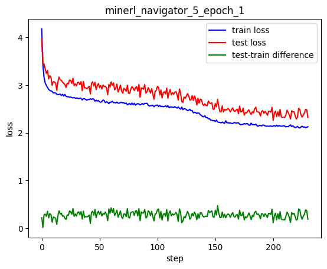
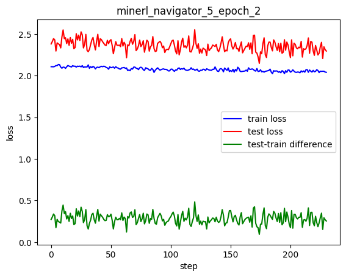
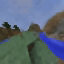
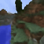
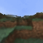

# minerl_dreamer

**Problem**

in this repository, i attempt to train a machine learning model based on the transformer architecture to simulate minecraft in 64x64xRGB space. To put it precisely, i want to approximate the following function:

**input**: current frame, actions (restricted to movement and camera actions to simplify learning)

**output**: next frame

to reduce the dimensionality of the input and output, i train a VQ-VAE to learn to encode a 64x64xRGB minecraft video frame into a latent vector of 256 integers and decode it back to 64x64xRGB. the training of the transformer is entirely done in the trained VQ-VAE's latent space. 
camera actions at each frame are defined as changing the yaw or pitch by some continuous degree in (-180, 180). to tokenize camera actions, i use a simple binning method with more bins concentrated around 0. 

&nbsp;

**Model Architecture**

i use the original encoder-decoder transformer architecture. 

**approach 1**: the encoder learns a representation of the current frame, which is used by the decoder as a context to inform its token prediction process. the decoder learns to generate a fixed length sequence consisted of action tokens followed by a latent vector representing the next frame. once the model is trained, to generate the next frame, i feed the current frame to the encoder and the action tokens to the decoder to start off the token prediction process. putting it in NLP terms, the action tokens are the "prompt" or "start of the sentence". 

**approach 2**: use the encoder to encode the actions and use the decoder to produce a sequence consisted of the current frame and the next frame. in this case, the current frame is the "prompt". 

&nbsp;

**Data**

source: minecraft navigation datasets from [MineRL](https://minerl.io/docs/index.html).

size: train set has 950k samples; test set has 50k samples. 

&nbsp;

**Approach 1 Result**

model size: 768 hidden dimensions + 6 encoder layers + 8 decoder layers ~= 110M parameters

after 1 epoch, the training loss got down to about 2.15. the test loss got down to about 2.55. near the end of the training, it seems that train loss and test loss begin to diverge. by repeatedly feeding its generated output as the new input, i found that the model was not able to generate a sequence of consistent looking frames. everything quickly collapsed into something that did not look like minecraft at all after just a few frames. 

&nbsp;

**Approach 2 Result**

model size: 768 hidden dimensions + 4 encoder layers + 12 decoder layers ~= 136M parameters

this approach has a lot more success. the training loss got down to about 2.13, and the test loss got down to about 2.40, which is a significantly smaller difference between test loss and train loss. in epoch 2, the training loss seems to continue to decrease at a very small constant rate, reaching 2.05 at the end.  here are the loss graphs for the first and second epochs. 

demos (look blurry because these are VQ-VAE decoded images):

real: the player is just standing still

simulating the forward action for 32 frames

real

simulated

real

simulated

&nbsp;

**Using data from random actions** 

the datasets used in previous approaches are collected from a specific activity in minecraft: navigation. during this activity, the character continuously traverses predominantly in the forward direction. as a result, there exists a scarcity of samples depicting the character in stationary positions or instances where the character gazes upward into the sky or downward at the ground. to comprehensively grasp the dynamics of movement and observation within the 3d minecraft environment, i believe that a dataset generated from random actions would be better suited. such a dataset could facilitate a more consistent and fluid understanding of how various actions change what is rendered on the screen. 

will try this in the future...

&nbsp;

**main packages used**:

[VQ-VAE](https://github.com/nadavbh12/VQ-VAE)

[x-transformers](https://github.com/lucidrains/x-transformers)
